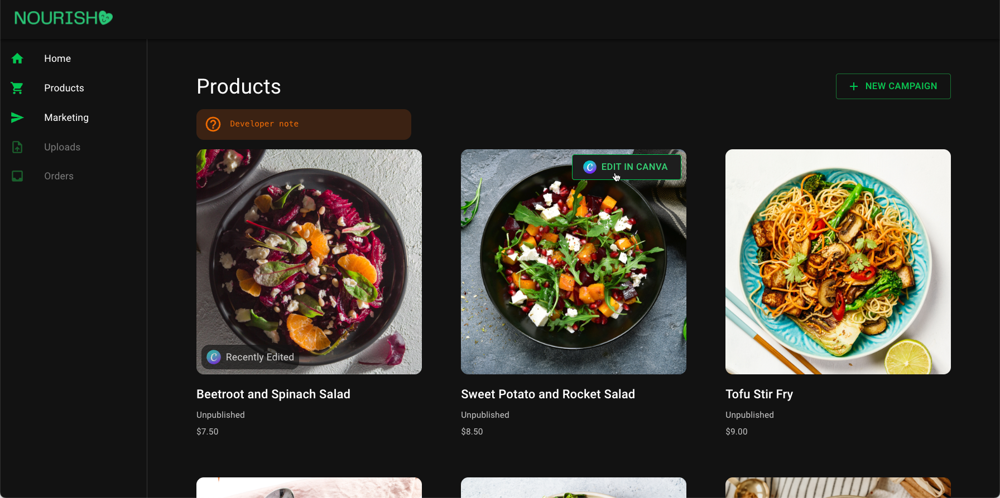

# Demos: E-commerce Shop

Welcome to the **Nourish e-commerce shop** demo! 🛍️

A lightweight e-commerce shop demo that showcases how to integrate with the Canva API. The demo demonstrates:

- Editing product images in Canva and displaying the updated designs back in the shop.
- Creating individual designs in custom sizes from existing products.
- Creating multiple designs at once by adding products to your Canva Brand Templates.

## Brand Templates Setup

To get started with Brand Templates, you can install sample templates from [this Brand Template deck](https://www.canva.com/design/DAGGkcb61HQ/OJhMIQrmz2daIoxo8u3T2g/view).

[See the main README for e-commerce shop demo instructions](../../README.md#demos-e-commerce-shop)
